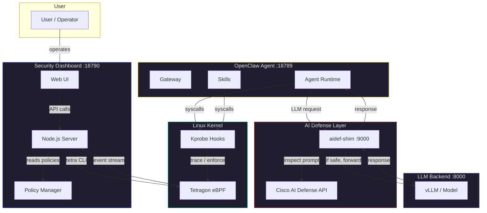
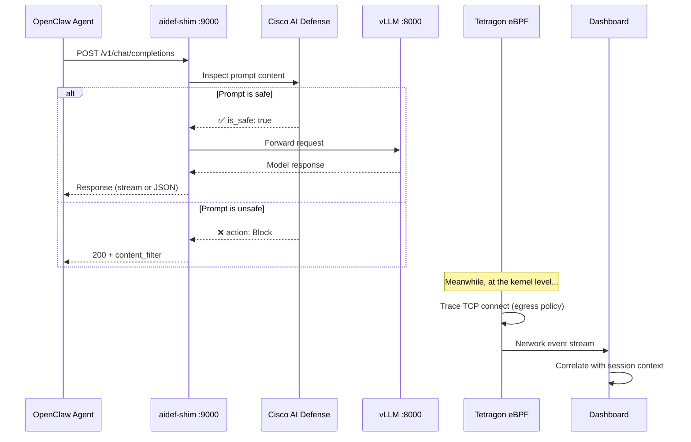
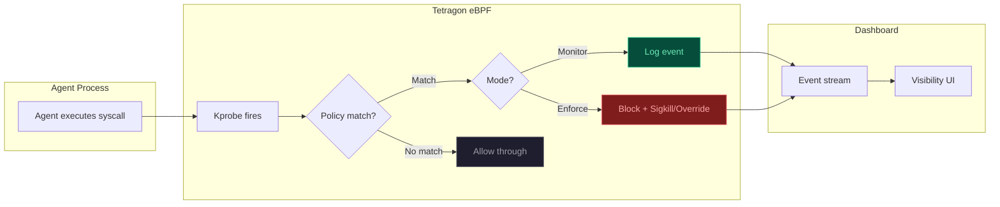
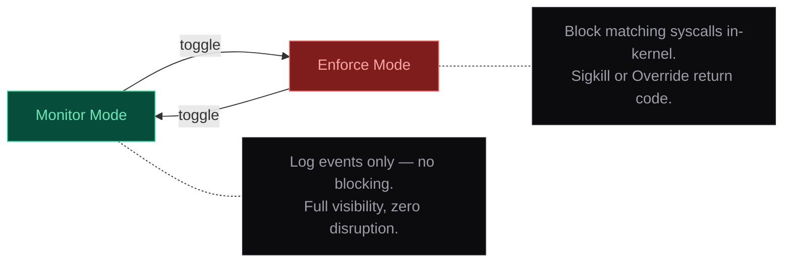
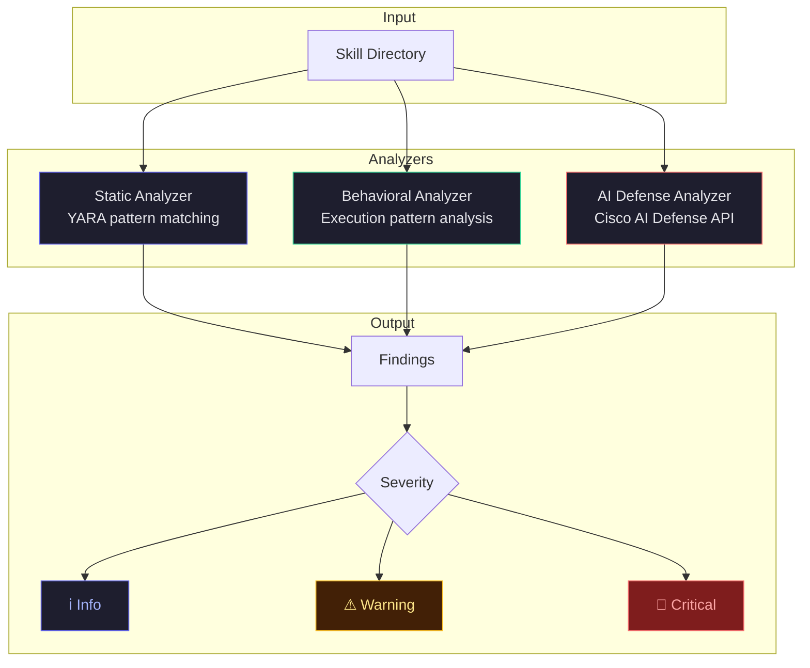
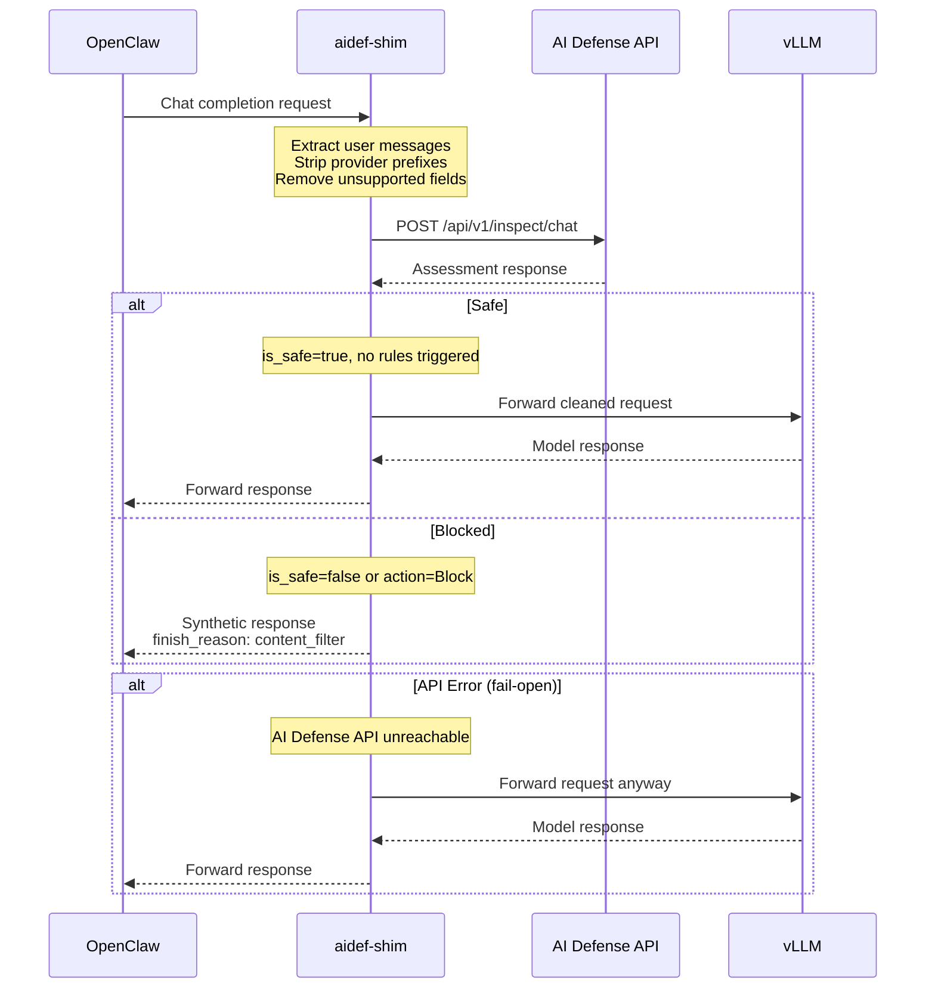
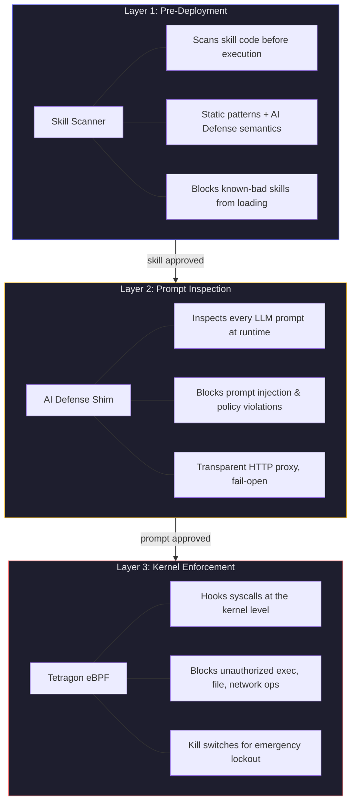

# OpenClaw Security Dashboard

**Proof of concept only** — not production-ready.

Runtime security visibility and policy enforcement for [OpenClaw](https://github.com/open-claw/openclaw) AI agents, powered by Cilium Tetragon eBPF.

---

## Overview

The Security Dashboard provides real-time observability into everything an AI agent does at the system level — process execution, file access, network connections — and the ability to enforce security policies that constrain agent behavior. It combines three layers of defense:

| Layer | What it does | Where it runs |
|---|---|---|
| **Tetragon (eBPF)** | Kernel-level tracing and enforcement of syscalls | Linux kernel via eBPF |
| **AI Defense Shim** | Prompt-level inspection of LLM requests | HTTP proxy (port 9000) |
| **Skill Scanner** | Pre-deployment static + semantic analysis of agent skills | CLI tool invoked by dashboard |

---

## Architecture

### System Overview



### Request Flow: LLM API Call

Every LLM request from the agent passes through two independent security checkpoints — one at the application layer (AI Defense) and one at the kernel layer (Tetragon).



### Enforcement: Tetragon eBPF Pipeline

Tetragon hooks into kernel syscalls via eBPF kprobes. When an agent process triggers a hooked syscall, Tetragon evaluates the configured policy and either logs the event (monitor mode) or blocks it in-kernel before it completes (enforce mode).



---

## Tetragon Policies

Policies are Cilium TracingPolicy resources defined in YAML. Each policy hooks one or more kernel functions and specifies what to do when the hook fires.

### Core Policies

| Policy | Hooks | What it traces |
|---|---|---|
| `oc-file-ops` | `security_file_open`, `vfs_write`, `do_unlinkat` | File open, write, and delete operations on workspace and sensitive paths |
| `oc-tool-exec` | `__arm64_sys_execve` | Execution of tool binaries — curl, wget, git, python, node, etc. |
| `oc-llm-api-egress` | `tcp_connect` | Outbound TCP connections from agent processes |
| `oc-skill-sandbox` | `__arm64_sys_execve`, `security_file_open` | Any exec or file access originating from skill/clawhub directories |
| `oc-sensitive-files` | `security_file_open` | Access to credentials, SSH keys, kubeconfig, cloud tokens |
| `oc-priv-ops` | `bpf`, `init_module` | Privileged operations like BPF syscalls and kernel module loads |

### Kill Switches

Emergency lockout policies that can be activated from the dashboard footer. They auto-expire after 60 seconds.

| Kill Switch | Effect |
|---|---|
| `oc-ks-exec` | Blocks **all** subprocess execution (`execve`) from OpenClaw processes |
| `oc-ks-net` | Blocks **all** outbound TCP connections from OpenClaw processes |

### Policy Modes

Each policy operates in one of two modes, togglable from the dashboard:



---

## Skill Scanner

The Skill Scanner analyzes agent skills (plugins) **before** they execute, identifying security risks through multiple analysis engines.

### Scanner Pipeline



### Analyzers

**Static Analyzer** — Pattern-based code analysis using YARA rules. Detects dangerous patterns like `eval()`, shell injection, crypto-mining signatures, and credential harvesting. Runs with a configurable policy preset: `permissive`, `balanced`, or `strict`.

**Behavioral Analyzer** — Analyzes execution patterns and control flow for suspicious behavior like obfuscated code, data exfiltration patterns, or privilege escalation attempts.

**AI Defense Analyzer** — Sends skill content to the Cisco AI Defense cloud API for semantic threat analysis. Checks for prompt injection, harassment, hate speech, and other content policy violations using the same engine that powers the runtime aidef-shim.

---

## AI Defense Shim

The aidef-shim is an HTTP proxy that sits between OpenClaw and the upstream LLM. It inspects every prompt before it reaches the model.

### How It Works



### Configuration

| Variable | Default | Purpose |
|---|---|---|
| `PORT` | `9000` | Shim listen port |
| `UPSTREAM_URL` | `http://127.0.0.1:8000/v1` | vLLM backend |
| `AI_DEFENSE_API_KEY` | — | Cisco AI Defense API key |
| `AI_DEFENSE_REGION` | `us` | API region (`us`, `eu`, `ap`) |

The shim is transparent to OpenClaw — the agent config simply points its LLM provider URL at `http://127.0.0.1:9000/v1` instead of directly at vLLM.

---

## Defense in Depth

The three security layers operate independently and complement each other:



Each layer catches threats the others might miss:
- The **Skill Scanner** prevents known-malicious code from ever running.
- The **AI Defense Shim** blocks adversarial prompts that could trick the model into harmful actions.
- **Tetragon eBPF** enforces hard boundaries at the kernel level — even if a prompt slips through and the model generates a dangerous command, the kernel policy blocks the syscall before it executes.

---

## Dashboard Tabs

| Tab | Description |
|---|---|
| **Activity Feed** | Unified timeline merging OpenClaw session events with Tetragon kernel events. See what the agent is doing and what the kernel is observing side by side. |
| **LLM & API** | Network connection events filtered for LLM API egress. Highlights unknown or unexpected outbound connections. |
| **Tool Exec** | Process execution events — every binary the agent spawns. Filter by process name or arguments. |
| **File Ops** | File system events — opens, writes, deletes. See exactly what the agent reads and modifies. |
| **Skill Events** | Events originating from skill directories. Flags out-of-sandbox access and sensitive file touches. |
| **Skill Scanner** | Run the skill scanner, configure analyzers, view findings with severity levels and source code context. |
| **Policies** | View and edit Tetragon policy YAML. Toggle between monitor and enforce modes. Activate kill switches. |

---

## Quick Start

**Before first run:** Policy YAMLs in `policies/` use `/home/cuneocode` for paths. Replace with your home directory (e.g. `sed -i 's|/home/cuneocode|'$HOME'|g' policies/*.yaml`) before applying.

```bash
# Start the dashboard server
node server.mjs

# Open in browser
open http://localhost:18790
```

The dashboard expects Tetragon to be running with the `tetra` CLI available at `/usr/local/bin/tetra`. Policies in the `policies/` directory are loaded via `tetra tp add`.

---

## Ports

| Service | Port | Purpose |
|---|---|---|
| vLLM | 8000 | LLM model serving |
| aidef-shim | 9000 | AI Defense prompt inspection proxy |
| OpenClaw Gateway | 18789 | Agent gateway and control plane |
| Security Dashboard | 18790 | This dashboard |
